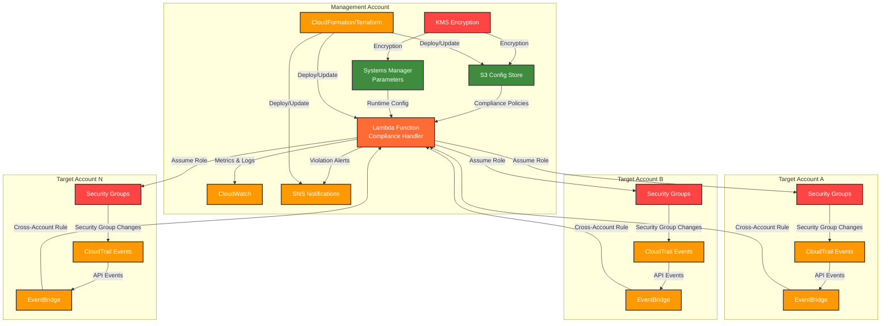
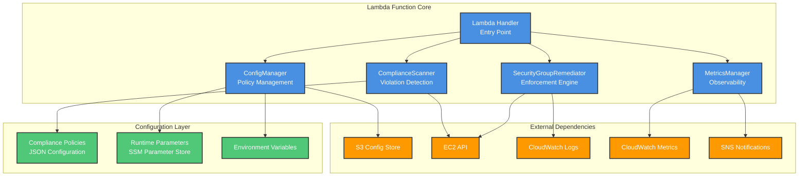
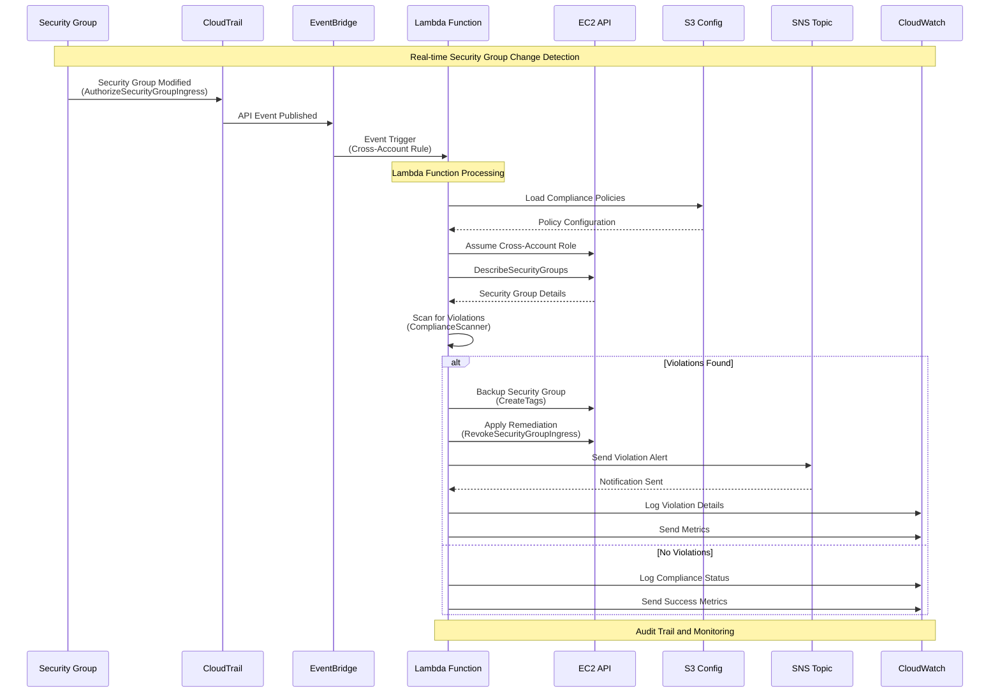
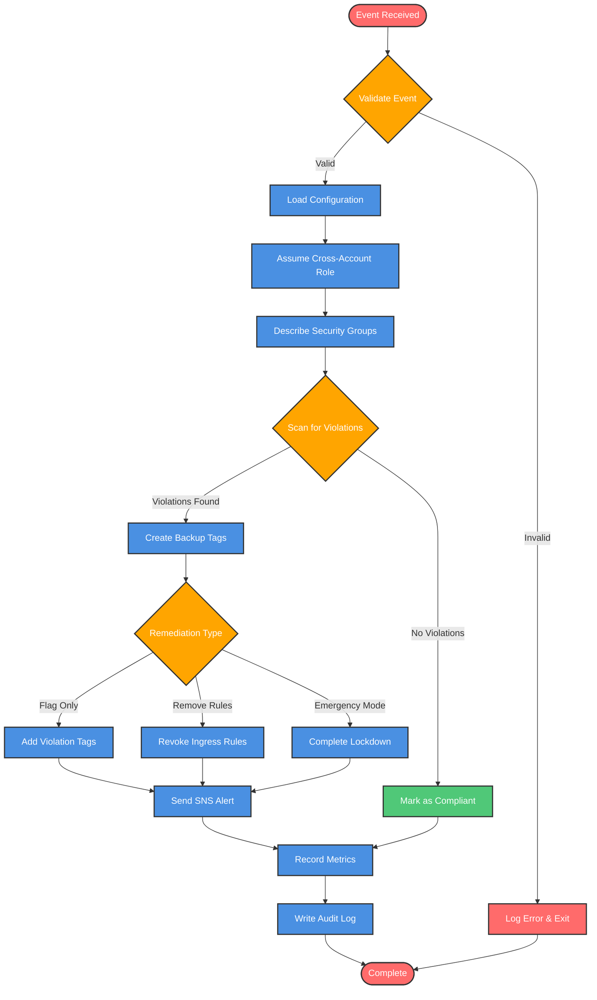
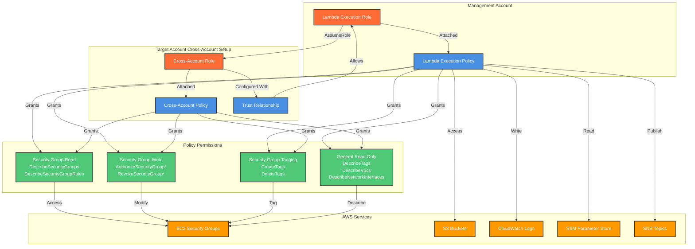
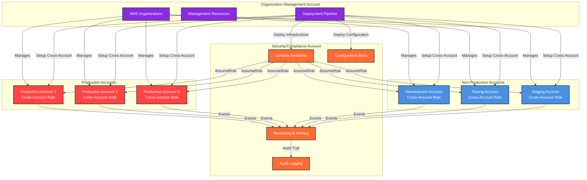
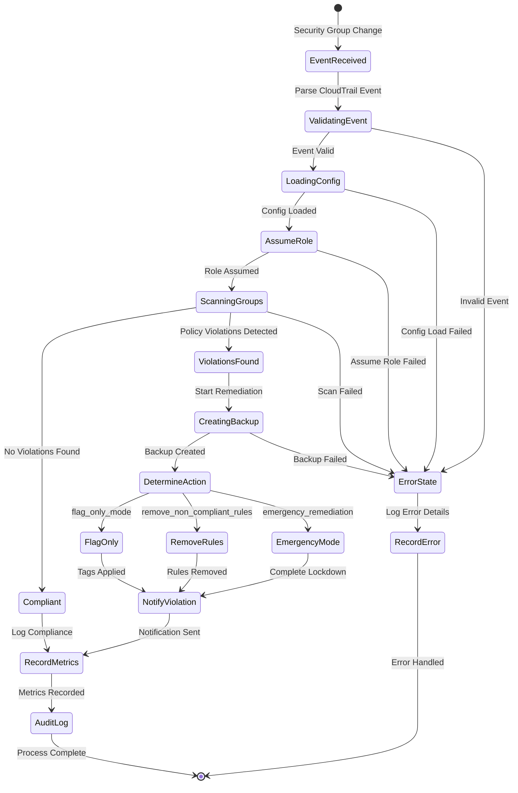

# AWS Security Group Compliance Framework - Architecture Documentation

## Overview

The AWS Security Group Compliance Framework is an event-driven, multi-account security remediation system built on AWS serverless technologies. It provides automated scanning, compliance checking, and remediation of security group violations across AWS organizations.

## High-Level Solution Architecture

## Component Architecture

### Core Components

## Event-Driven Processing Flow

## Compliance Scanning Workflow

## Security and IAM Architecture

## Multi-Account Deployment Model

## Data Flow and State Management

## Technology Stack

### Infrastructure Layer
- **Terraform**: Infrastructure as Code for AWS resource provisioning
- **AWS Lambda**: Serverless compute for compliance processing
- **AWS IAM**: Identity and access management with cross-account roles
- **AWS EventBridge**: Event-driven architecture for real-time processing
- **AWS CloudTrail**: API call auditing and change detection

### Data and Configuration Layer
- **AWS S3**: Configuration storage and backup repository
- **AWS Systems Manager**: Parameter store for runtime configuration
- **AWS KMS**: Encryption for data at rest and in transit
- **JSON**: Policy definition and configuration format

### Monitoring and Observability
- **AWS CloudWatch**: Logging, metrics, and monitoring
- **AWS SNS**: Notification and alerting system
- **Custom Metrics**: Business-specific compliance metrics
- **Structured Logging**: JSON-formatted audit trails

### Development and Deployment
- **Python 3.11**: Lambda runtime for business logic
- **boto3/botocore**: AWS SDK for Python
- **GitHub Actions**: CI/CD pipeline automation
- **Checkov**: Infrastructure security scanning

## Security Features

### Defense in Depth
1. **Least Privilege IAM**: Granular permissions with resource-specific ARNs
2. **Cross-Account Isolation**: Separate execution and target account boundaries
3. **Encryption**: KMS encryption for all data at rest and parameter storage
4. **Audit Logging**: Comprehensive CloudTrail and application logging
5. **Network Security**: VPC-based deployment with security group controls

### Compliance Controls
1. **Policy Validation**: Schema-based configuration validation
2. **Change Tracking**: Full audit trail of all remediation actions
3. **Rollback Capability**: Backup tags enable violation rollback
4. **Non-Disruptive Mode**: Flag-only mode for initial deployment
5. **Emergency Response**: Rapid lockdown capabilities for critical violations

### Operational Security
1. **Idempotent Operations**: Safe to run multiple times without side effects
2. **Error Handling**: Graceful failure with detailed error reporting
3. **Rate Limiting**: Controlled API usage to prevent service limits
4. **State Management**: Stateless design with external configuration
5. **Monitoring**: Real-time alerting for security violations and system errors

## Scalability and Performance

### Horizontal Scaling
- **Event-Driven**: Automatic scaling based on security group changes
- **Multi-Account**: Supports unlimited target accounts
- **Regional Deployment**: Per-region Lambda deployments for performance
- **Concurrent Processing**: Parallel processing of multiple accounts

### Performance Optimization
- **Efficient Scanning**: Targeted security group queries
- **Caching**: Configuration caching to reduce S3 API calls
- **Batch Operations**: Group operations for improved throughput
- **Regional Constraints**: Limit operations to specific AWS regions

This architecture provides a robust, scalable, and secure foundation for automated security group compliance across multi-account AWS environments while maintaining operational simplicity and comprehensive auditability.
