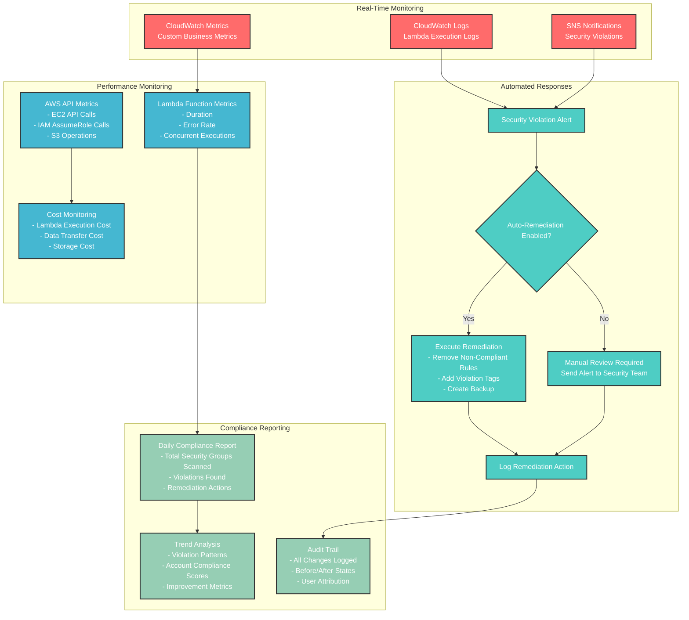
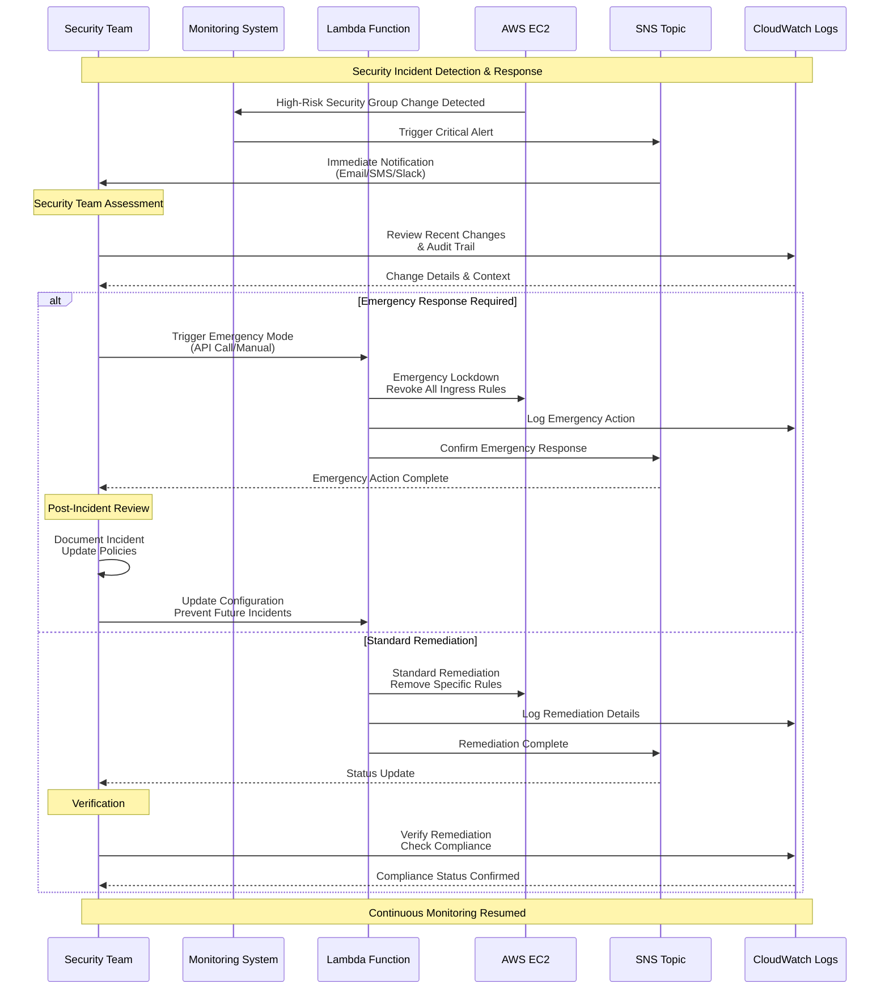
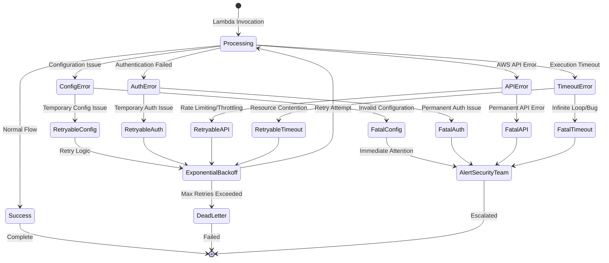
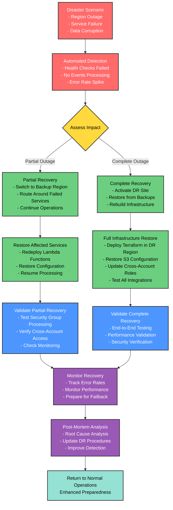

# Deployment and Operational Flows

## Deployment Flow Diagram

```mermaid
flowchart TD
    START([Start Deployment]) --> PREREQ{Prerequisites Check}
    
    PREREQ -->|Missing| SETUP[Setup Requirements<br/>- AWS CLI configured<br/>- Terraform installed<br/>- Multi-account access]
    PREREQ -->|Complete| INIT[Initialize Terraform]
    
    SETUP --> INIT
    
    INIT --> PLAN[Terraform Plan<br/>Review Infrastructure Changes]
    PLAN --> APPROVE{Approve Changes?}
    
    APPROVE -->|No| MODIFY[Modify Configuration]
    APPROVE -->|Yes| APPLY[Terraform Apply]
    
    MODIFY --> PLAN
    
    APPLY --> DEPLOY_MGMT[Deploy Management Resources<br/>- Lambda Function<br/>- IAM Roles<br/>- S3 Bucket<br/>- SNS Topic]
    
    DEPLOY_MGMT --> CONFIG_UPLOAD[Upload Compliance Policies<br/>to S3 Configuration Store]
    
    CONFIG_UPLOAD --> CROSS_ACCOUNT{Deploy Cross-Account Roles?}
    
    CROSS_ACCOUNT -->|Yes| DEPLOY_TARGETS[Deploy to Target Accounts<br/>- Cross-Account IAM Roles<br/>- EventBridge Rules<br/>- CloudTrail Integration]
    CROSS_ACCOUNT -->|No| TEST_DEPLOY
    
    DEPLOY_TARGETS --> TEST_DEPLOY[Test Deployment<br/>- Create Test Security Group<br/>- Trigger Compliance Check<br/>- Verify Remediation]
    
    TEST_DEPLOY --> VALIDATE{Validation Successful?}
    
    VALIDATE -->|Failed| DEBUG[Debug Issues<br/>- Check CloudWatch Logs<br/>- Verify IAM Permissions<br/>- Test Cross-Account Access]
    VALIDATE -->|Success| MONITOR[Setup Monitoring<br/>- CloudWatch Dashboards<br/>- SNS Subscriptions<br/>- Alert Thresholds]
    
    DEBUG --> TEST_DEPLOY
    
    MONITOR --> COMPLETE([Deployment Complete])
    
    classDef start fill:#90EE90,stroke:#333,stroke-width:2px,color:#000
    classDef process fill:#87CEEB,stroke:#333,stroke-width:2px,color:#000
    classDef decision fill:#FFD700,stroke:#333,stroke-width:2px,color:#000
    classDef action fill:#FFA07A,stroke:#333,stroke-width:2px,color:#000
    classDef end fill:#98FB98,stroke:#333,stroke-width:2px,color:#000
    
    class START,COMPLETE start
    class SETUP,INIT,PLAN,APPLY,DEPLOY_MGMT,CONFIG_UPLOAD,DEPLOY_TARGETS,TEST_DEPLOY,DEBUG,MONITOR process
    class PREREQ,APPROVE,CROSS_ACCOUNT,VALIDATE decision
    class MODIFY action
```

## Operational Monitoring Flow



## Incident Response Workflow



## Configuration Management Flow

```mermaid
flowchart LR
    subgraph "Policy Development"
        DEV[Policy Developer] --> DRAFT[Draft Policy JSON]
        DRAFT --> VALIDATE[Schema Validation]
        VALIDATE --> TEST[Test in Non-Prod]
    end
    
    subgraph "Approval Process"
        TEST --> REVIEW[Security Review]
        REVIEW --> APPROVE[Management Approval]
        APPROVE --> VERSION[Version Control]
    end
    
    subgraph "Deployment"
        VERSION --> UPLOAD[Upload to S3]
        UPLOAD --> NOTIFY[Notify Lambda]
        NOTIFY --> RELOAD[Reload Configuration]
    end
    
    subgraph "Monitoring"
        RELOAD --> MONITOR[Monitor Impact]
        MONITOR --> METRICS[Collect Metrics]
        METRICS --> FEEDBACK[Feedback Loop]
    end
    
    FEEDBACK --> DEV
    
    classDef development fill:#E1F5FE,stroke:#0277BD,stroke-width:2px
    classDef approval fill:#FFF3E0,stroke:#F57C00,stroke-width:2px
    classDef deployment fill:#E8F5E8,stroke:#388E3C,stroke-width:2px
    classDef monitoring fill:#FCE4EC,stroke:#C2185B,stroke-width:2px
    
    class DEV,DRAFT,VALIDATE,TEST development
    class REVIEW,APPROVE,VERSION approval
    class UPLOAD,NOTIFY,RELOAD deployment
    class MONITOR,METRICS,FEEDBACK monitoring
```



## Error Handling and Recovery



## Disaster Recovery Process


